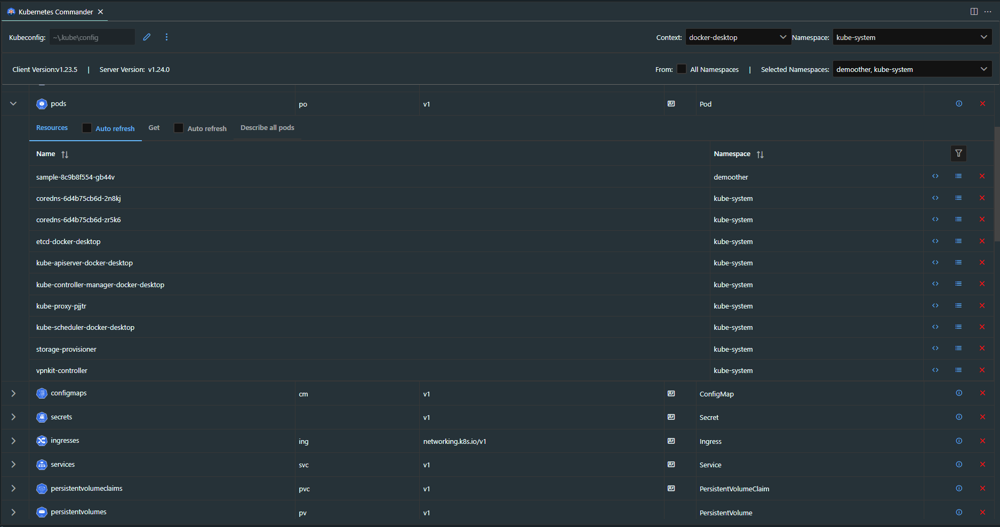

# Kubernets Commander VSCode extension

This VSCode extension builds on top of [Kubernetes](https://marketplace.visualstudio.com/items?itemName=ms-kubernetes-tools.vscode-kubernetes-tools) VSCode extension.

It uses the `kubectl api-resources` command to discover the set of supported API resources and allows the user to explore various aspects of those resources. It also treas Helm releases the same way and thus provides a unified view.

You can use the following complimentary VSCode extension if you want to view the API Resources in tree like view.

[Kubernetes Api Resources in Clusters Explorer](https://marketplace.visualstudio.com/items?itemName=sandipchitale.vscode-kubernetes-api-resources)

# Features

- The extension provides a VSCode Webview based expandable table UI to:
  - the toolbar shows:
    - Location of `KUBECONFIG` (~/.kube/config is the default value)
    - command to edit the `KUBECONFIG`
    - command to set a different `KUBECONFIG`
    - current context i.e. current cluster + user + namespace combination
    - `kubectl` version and Cluster control plane or API server versions
    - a multi-select dropdown to select the set of Kubernetes `namespaces` from which the instances of API resources are displayes in the tabular UI
  - displays the discovered API resources in a table
    - expanding the API resource row shows all the instances of the API Resource from the selected namespaces. Some API resources are obviously not `namespace` scoped.

Below are some specific features related to Helm and Kubernetes.

## Helm

- Helm releases as a API resource type thus unifying the view with Kubernetes API resources
  - Link to external documentation on Helm
- Compare revisions of different releases (choose one of manifest, values, notes, hooks, templates, all)
- Compare two diffrent revisions of same release (choose one of manifest, values, notes, hooks, templates, all)
- Display the manifest of the selected revision of the Helm release
- Describe the complete information about the selected revision of a Helm release
- Uninstall all or selected Helm releases

## Kubernetes

- Display API resources discovered using `kubectl api-resources` command in a tabular form
  - Link to external documentation of the API resource
- Deletion of all or selected resources of a selected type
- Show all instances of API resources
  - show instances in tabular form
  - show `kubectl get` command output
  - show `kubectl describe` command output
  - optional auto-refresh mode

# Known Issues

None

[File a issue](https://github.com/sandipchitale/vscode-kubernetes-commander-editor/issues)

## See also

- [Kubernetes Api Resources in Clusters Explorer](https://marketplace.visualstudio.com/items?itemName=sandipchitale.vscode-kubernetes-api-resources)
- [Kubernetes Pod File System Explorer and extras](https://marketplace.visualstudio.com/items?itemName=sandipchitale.kubernetes-file-system-explorer)
- [Helm Extras](https://marketplace.visualstudio.com/items?itemName=sandipchitale.vscode-kubernetes-helm-extras)
